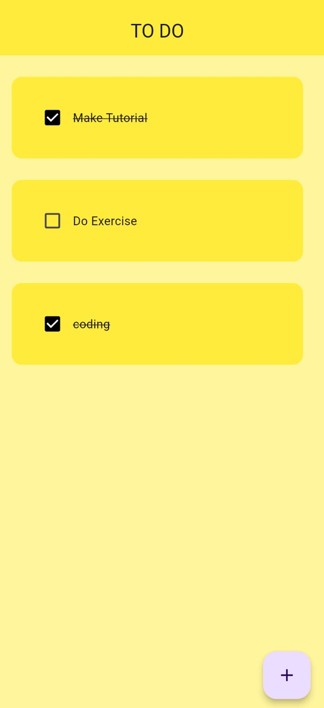
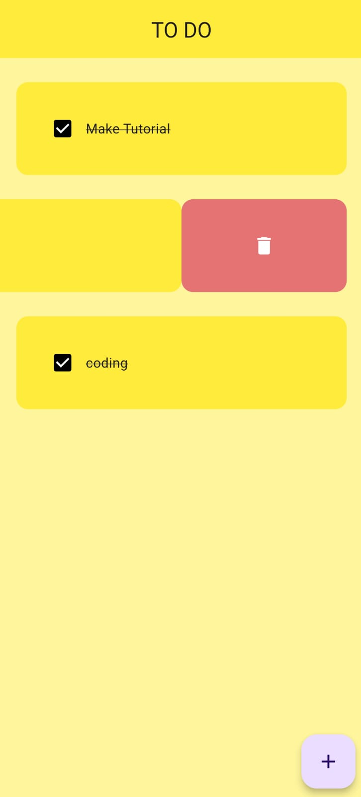

# Flutter To-Do App

A simple To-Do application built using Flutter and Hive for local storage.

## Features

- Add new tasks
- Mark tasks as complete/incomplete
- Delete tasks
- Persist tasks using Hive database

## Images


## Getting Started

### Prerequisites

- [Flutter](https://flutter.dev/docs/get-started/install) installed
- [Hive] and [Hive Flutter] packages

### Installation

1. Clone the repository:

   ```sh
   git clone https://github.com/RohitShalgar4/to_do_Flutter.git
   cd to_do_Flutter
